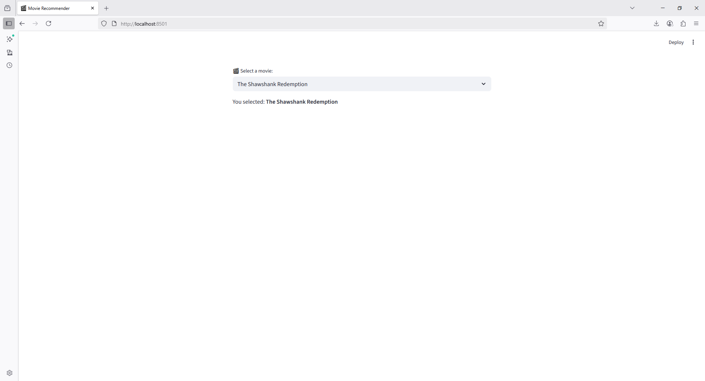

You're almost there 👍. In your `st.selectbox`, you need to pass the list of movies as options. Right now, you only gave the label. Here’s a corrected version:

```python
import streamlit as st

st.set_page_config(
    page_title="Movie Recommender",
    page_icon="🎬",
    layout="centered"
)

# Example list of movies
movies = [
    "The Shawshank Redemption",
    "The Dark Knight",
    "Inception",
    "Interstellar",
    "Fight Club",
    "The Matrix"
]

selected_movie = st.selectbox("🎬 Select a movie:", movies)

st.write(f"You selected: **{selected_movie}**")
```

👉 This will show a dropdown with the movie names and display the selected one.

Do you want me to also add a **recommendation system** (like suggesting similar movies after selection), or just keep it as a dropdown for now?

