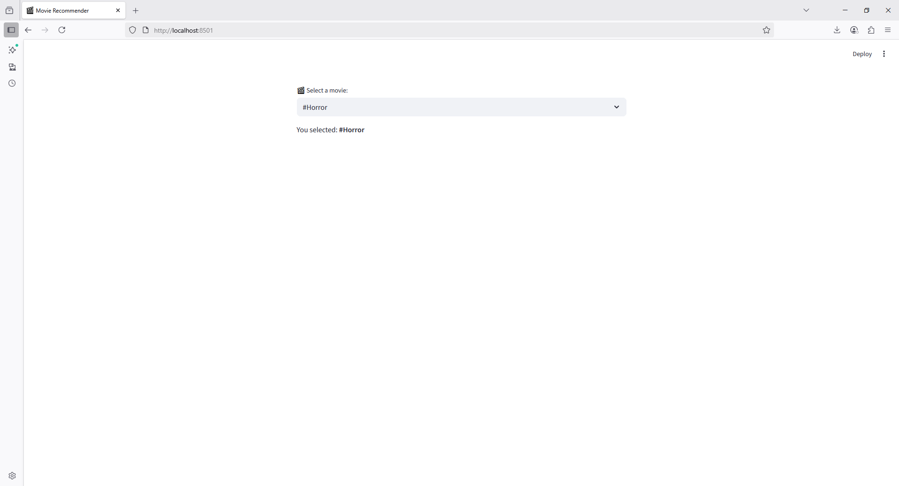
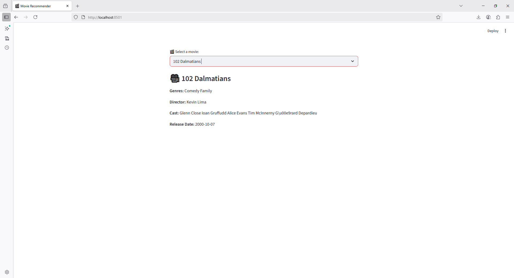

Got it ✅ — you want to load your movies from a CSV instead of hardcoding them.
Here’s the corrected code using **pandas** to read `movies.csv`:

```python
import streamlit as st
import pandas as pd

st.set_page_config(
    page_title="Movie Recommender",
    page_icon="🎬",
    layout="centered"
)

# Read the CSV file (make sure movies.csv is in the same folder or give full path)
df = pd.read_csv("movies.csv")

# Get unique movie titles, drop missing values, and sort
movie_list = sorted(df['title'].dropna().unique())

# Show dropdown
selected_movie = st.selectbox("🎬 Select a movie:", movie_list)

st.write(f"You selected: **{selected_movie}**")
```

⚡ Notes:

* Replace `"movies.csv"` with the correct path if your file is in another directory.
* Ensure your CSV has a column named `title`.

Do you also want me to add a **basic recommender logic** (e.g., show 5 similar movies based on the selected one)?


```python
import streamlit as st
import pandas as pd

st.set_page_config(
    page_title="Movie Recommender",
    page_icon="🎬",
    layout="centered"
)

# Load CSV file
df = pd.read_csv("movies.csv")

# Get unique movies
movie_list = sorted(df['title'].dropna().unique())

# Movie dropdown
selected_movie = st.selectbox("🎬 Select a movie:", movie_list)

# Filter the dataframe for the selected movie
movie_data = df[df['title'] == selected_movie].iloc[0]

# Display movie details
st.subheader(f"🎥 {selected_movie}")
st.write(f"**Genres:** {movie_data['genres']}")
st.write(f"**Director:** {movie_data['director']}")
st.write(f"**Cast:** {movie_data['cast']}")
# st.write(f"**Crew:** {movie_data['crew']}")
st.write(f"**Release Date:** {movie_data['release_date']}")
```



