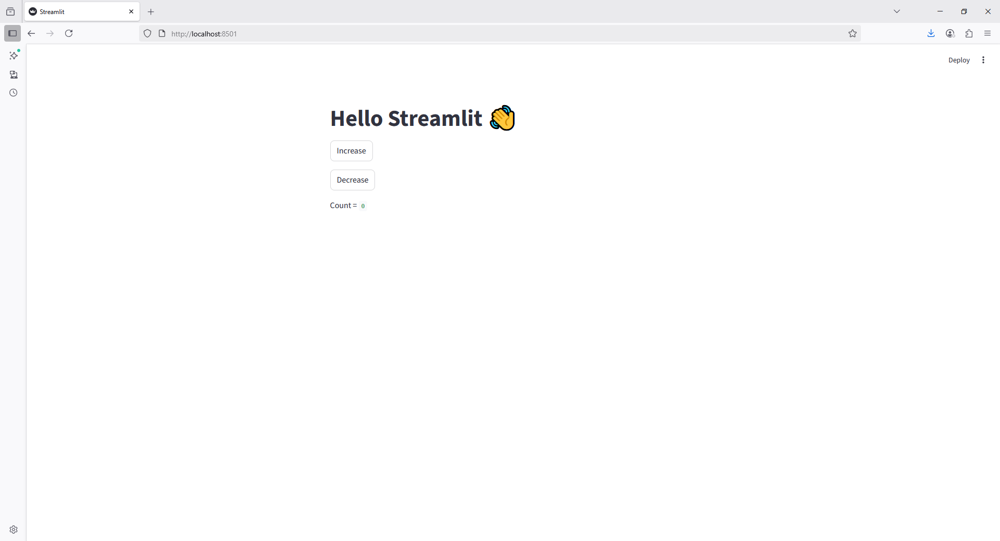

```python
import streamlit as st

st.title("Hello Streamlit 👋")

if "count" not in st.session_state:
    st.session_state.count = 0

if st.button("Increase"):
    st.session_state.count += 1

if st.button("Decrease"):
    st.session_state.count -= 1

st.write("Count =", st.session_state.count)
```

