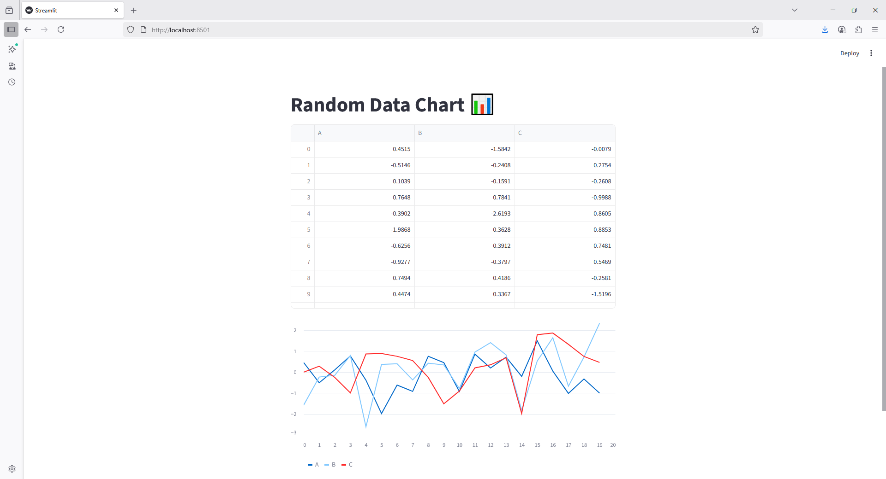

```python
import streamlit as st
import pandas as pd
import numpy as np

st.title("Random Data Chart 📊")

df = pd.DataFrame(
    np.random.randn(20, 3),
    columns=['A', 'B', 'C']
)

st.dataframe(df)

st.line_chart(df)
```

