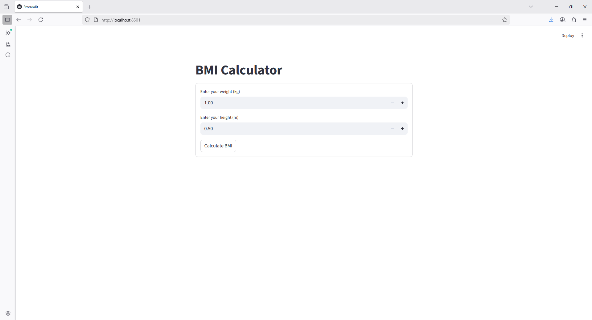
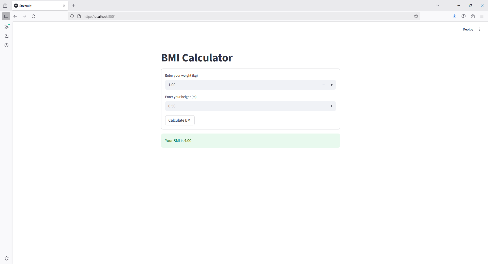

```python
import streamlit as st

st.title("BMI Calculator")

with st.form("bmi_form"):
    weight = st.number_input("Enter your weight (kg)", min_value=1.0, step=0.1)
    height = st.number_input("Enter your height (m)", min_value=0.5, step=0.01)
    submitted = st.form_submit_button("Calculate BMI")

if submitted:
    bmi = weight / (height ** 2)
    st.success(f"Your BMI is {bmi:.2f}")
```



