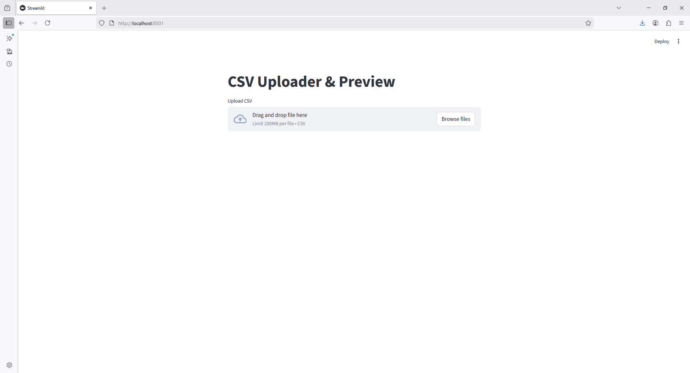

```python
import streamlit as st
import pandas as pd

st.title("CSV Uploader & Preview")

file = st.file_uploader("Upload CSV", type=["csv"])

if file is not None:
    df = pd.read_csv(file)
    st.write("Preview of uploaded file:")
    st.dataframe(df.head())
```

