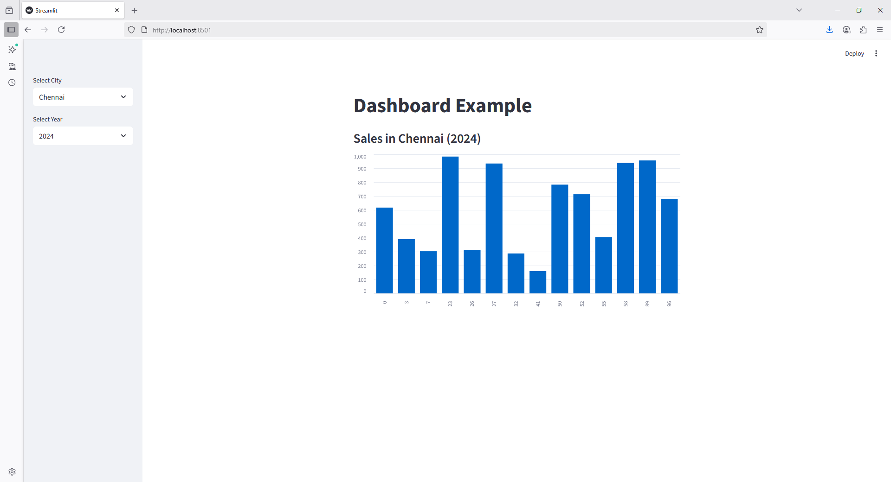

```python
import streamlit as st
import pandas as pd
import numpy as np

st.title("Dashboard Example")

# Fake data
df = pd.DataFrame({
    "City": np.random.choice(["Delhi", "Mumbai", "Chennai"], 100),
    "Sales": np.random.randint(100, 1000, 100),
    "Year": np.random.choice([2022, 2023, 2024], 100)
})

# Sidebar filters
city = st.sidebar.selectbox("Select City", df["City"].unique())
year = st.sidebar.selectbox("Select Year", df["Year"].unique())

# Filtered data
filtered = df[(df["City"] == city) & (df["Year"] == year)]

st.write(f"### Sales in {city} ({year})")
st.bar_chart(filtered["Sales"])
```

